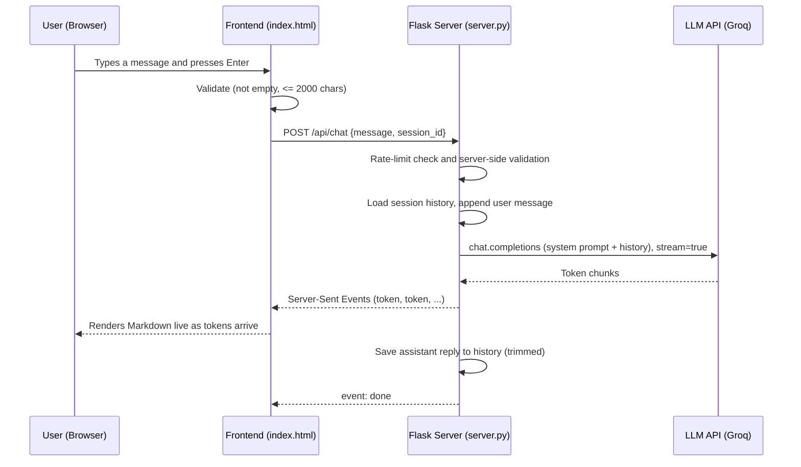

# 🤖 AI Chatbot Tech

> **Nova** — a production-minded AI chatbot with a Python (Flask) backend, a clean web interface, real-time streaming responses, conversation memory, Markdown rendering, voice input/output, and robust error handling.


-orange)


---

## 📑 Table of Contents

1. [Overview](#-overview)
2. [Features](#-features)
3. [Tech Stack](#-tech-stack)
4. [Architecture](#-architecture)
5. [Project Structure](#-project-structure)
6. [Getting Started](#-getting-started)
7. [Configuration](#-configuration)
8. [Usage](#-usage)
9. [API Reference](#-api-reference)
10. [The System Prompt](#-the-system-prompt)
11. [How It Works Internally](#-how-it-works-internally)
12. [Error Handling](#-error-handling)
13. [Security Notes](#-security-notes)
14. [Troubleshooting](#-troubleshooting)
15. [Deployment](#-deployment)
16. [What I Learned](#-what-i-learned)
17. [Problems and Solutions](#-problems-and-solutions)
18. [Roadmap](#-roadmap)
19. [Screenshots and Demo](#-screenshots-and-demo)
20. [License](#-license)

---

## 📖 Overview

**AI Chatbot Tech** is a full-stack chatbot application built as part of an AI internship program (Day 2 and Day 3 tasks). It connects to a Large Language Model (LLM) through an **OpenAI-compatible API**, streams the answer to the browser token by token, remembers earlier messages in the conversation, and presents answers in a clean, responsive chat interface.

The default provider is **[Groq](https://console.groq.com)**, which offers a free tier that does not require a credit card. Because the code uses the standard OpenAI client, you can switch to another provider (OpenRouter, Cerebras, OpenAI, a local Ollama server, etc.) by changing only three environment variables — no code changes needed.

**Assistant persona:** *Nova* — a friendly study and tech assistant that explains programming, AI, and technology step by step, and replies in the same language the user writes in (English, Urdu, or Roman Urdu).

---

## ✨ Features

### Core (Day 2)
| Feature | Description |
|---|---|
| User input | Multi-line text box; **Enter** sends, **Shift+Enter** adds a new line |
| AI response | Real LLM responses through an OpenAI-compatible API |
| Proper API integration | Secure server-side calls; the API key never reaches the browser |
| Loading state | Animated typing indicator, disabled input while waiting, live status text |
| Error handling | Friendly, specific messages for invalid key, rate limit, timeout, missing model, network failure |
| Clean interface | Dark, responsive single-page chat UI that works on desktop and mobile |
| System prompt | A defined role, personality, and style rules for the assistant |

### Improvements (Day 3)
| Feature | Description |
|---|---|
| Conversation history and memory | Server-side history per session, so follow-up questions work |
| Clear chat | One click deletes the history on the server and resets the UI |
| Better prompt structure | Structured system prompt with role and style rules, configurable via environment variable |
| Markdown responses | Headings, lists, tables, and syntax-highlighted-style code blocks, sanitized against XSS |
| Input validation | Empty, too-long, and malformed input rejected on **both** client and server |
| Response/error handling | Streaming errors handled mid-response; partial answers are preserved |
| Voice input / output | Speak your question with the microphone; have answers read aloud |
| Better UI | Suggestion chips, copy button, character counter, auto-growing text area |

### Production-oriented extras
- **Streaming (Server-Sent Events)** — answers appear instantly as they are generated
- **Automatic fallback model** — if the main model fails, a second one is tried
- **Model auto-discovery** — if the provider removes or renames a model (HTTP 404), the server asks the provider which models exist and picks a suitable chat model, so the bot keeps working
- **Per-IP rate limiting** — protects your free-tier quota from abuse
- **Request timeout and retry** — prevents hanging requests
- **History trimming** — only the last *N* messages are sent, keeping cost and latency low
- **Structured logging** — every request and failure is logged with timestamps
- **Health endpoint** — `/api/health` for monitoring
- **Configuration through environment variables** — nothing sensitive is hard-coded
- **Provider-agnostic** — switch LLM providers without touching code

---

## 🧰 Tech Stack

| Layer | Technology | Purpose |
|---|---|---|
| Language | Python 3.9+ | Backend logic |
| Web framework | Flask 3 | HTTP server and routes |
| LLM client | `openai` Python SDK | Talks to any OpenAI-compatible API |
| Config | `python-dotenv` | Loads `.env` file |
| Production server | `gunicorn` | Runs the app in production |
| LLM provider | Groq (default) | Free, fast inference |
| Default models | `openai/gpt-oss-120b` (main), `openai/gpt-oss-20b` (fallback) | Chat completions |
| Frontend | HTML, CSS, vanilla JavaScript | No build step, easy to read |
| Markdown | `marked` | Converts Markdown to HTML |
| Sanitizing | `DOMPurify` | Prevents XSS from model output |
| Voice | Web Speech API (browser built-in) | Speech recognition and synthesis |

---

## 🏗 Architecture

### High-level flow



### Component responsibilities

| Component | Responsibility |
|---|---|
| **Frontend** | UI rendering, client-side validation, reading the SSE stream, Markdown rendering, voice features, session id stored in `localStorage` |
| **Flask server** | Validation, rate limiting, session memory, prompt assembly, calling the LLM, streaming, error translation |
| **LLM API** | Generates the actual answer |

### Why this design?
- **Backend proxy**: the browser never sees the API key.
- **Stateless model, stateful server**: LLMs have no memory; the server stores history and re-sends it with each request.
- **SSE instead of WebSockets**: simpler, works over plain HTTP, ideal for one-way token streaming.
- **OpenAI-compatible client**: avoids vendor lock-in.

> **Note:** session history is stored in server memory. For multi-server or persistent deployments, replace the `_sessions` dictionary with Redis or a database.

---

## 📁 Project Structure

```
ai-chatbot-tech/
├── server.py            # Flask backend: routes, validation, memory, streaming, error handling
├── static/
│   └── index.html       # Frontend: UI, styles, and JavaScript in a single file
├── requirements.txt     # Python dependencies
├── .env.example         # Template for configuration (copy to .env)
├── .gitignore           # Keeps .env, venv, caches out of Git
├── .vscode/             # VS Code run/debug configuration
│   ├── launch.json
│   └── extensions.json
├── screenshots/         # (add your own) images used in this README
├── LICENSE              # MIT license
└── README.md            # This file
```

---

## 🚀 Getting Started

### Prerequisites
- **Python 3.9 or newer** — check with `python --version`
- **Git** (to clone/push the repository)
- A **free Groq API key** — create one at <https://console.groq.com/keys> (no credit card)

### 1. Clone the repository
```bash
git clone https://github.com/obaida521/ai-chatbot-tech.git
cd ai-chatbot-tech
```

### 2. Create and activate a virtual environment

**Windows (PowerShell)**
```powershell
python -m venv venv
venv\Scripts\activate
```
If PowerShell blocks activation, run `Set-ExecutionPolicy -Scope Process -ExecutionPolicy Bypass` first.

**macOS / Linux**
```bash
python3 -m venv venv
source venv/bin/activate
```

### 3. Install dependencies
```bash
pip install -r requirements.txt
```

### 4. Configure your API key
```bash
# Windows
copy .env.example .env
# macOS / Linux
cp .env.example .env
```
Open `.env` and set your key:
```
LLM_API_KEY=your_groq_api_key_here
```
> ⚠️ Never commit `.env` and never paste your key into chats, screenshots, or issues. `.gitignore` already excludes it.

### 5. Run the app
```bash
python server.py
```
Open **<http://localhost:5000>** in your browser (Chrome or Edge recommended for voice features).

To stop the server press **Ctrl + C**. In VS Code you can also press **F5** and choose *Run Nova Chatbot*.

---

## ⚙️ Configuration

All settings are read from environment variables (via `.env`). Only `LLM_API_KEY` is required.

| Variable | Default | Description |
|---|---|---|
| `LLM_API_KEY` | *(none)* | **Required.** Your provider API key |
| `LLM_BASE_URL` | `https://api.groq.com/openai/v1` | Any OpenAI-compatible endpoint |
| `LLM_MODEL` | `openai/gpt-oss-120b` | Main model |
| `LLM_FALLBACK_MODEL` | `openai/gpt-oss-20b` | Used if the main model fails |
| `SYSTEM_PROMPT` | Built-in "Nova" prompt | Overrides the assistant's role and style |
| `MAX_INPUT_CHARS` | `2000` | Maximum characters per user message |
| `MAX_HISTORY_MESSAGES` | `20` | Messages remembered per session |
| `RATE_LIMIT_PER_MIN` | `20` | Requests allowed per IP per minute |
| `REQUEST_TIMEOUT` | `30` | Seconds before an API call times out |
| `TEMPERATURE` | `0.6` | Creativity (0 = focused, 1 = creative) |
| `PORT` | `5000` | Server port |

### Switching providers

| Provider | `LLM_BASE_URL` | Example `LLM_MODEL` |
|---|---|---|
| Groq (default) | `https://api.groq.com/openai/v1` | `openai/gpt-oss-120b` |
| OpenRouter | `https://openrouter.ai/api/v1` | a model id ending in `:free` |
| OpenAI | `https://api.openai.com/v1` | a current OpenAI model id |
| Ollama (local) | `http://localhost:11434/v1` | e.g. `llama3.2` (key can be any text) |

> Free-tier model lists change over time. List what your key can use with:
> ```powershell
> $key = "YOUR_KEY"
> (Invoke-RestMethod -Uri https://api.groq.com/openai/v1/models -Headers @{Authorization="Bearer $key"}).data.id
> ```
> Remember that `whisper-*`, `orpheus-*`, `*guard*` models are not chat models.

---

## 💬 Usage

1. Type a message and press **Enter** (or click **Send**). Use **Shift + Enter** for a new line.
2. Watch the answer stream in. Code blocks, lists, and tables are rendered as Markdown.
3. Ask follow-up questions — Nova remembers the earlier conversation.
4. Click **📋 Copy** under an answer to copy it, or **🔊 Listen** to hear it.
5. Click the **🎤** button to dictate a question (Chrome/Edge).
6. Toggle **Voice on/off** to have every answer read aloud automatically.
7. Click **🗑 Clear chat** to wipe the memory and start fresh.

**Example prompts**
- "Explain what a REST API is in simple words."
- "Write a Python function that checks whether a string is a palindrome."
- "Roman Urdu mein batao: machine learning kya hoti hai?"

---

## 🔌 API Reference

### `GET /`
Serves the chat interface.

### `POST /api/chat`
Sends a message and streams the reply as **Server-Sent Events**.

**Request body (JSON)**
```json
{ "message": "Explain recursion", "session_id": "optional-uuid" }
```

**Stream events**
| Event | Data | Meaning |
|---|---|---|
| `meta` | `{"session_id": "..."}` | Session id to reuse for memory |
| `token` | `{"text": "..."}` | A piece of the answer |
| `error` | `{"message": "...", "status": 503}` | Friendly error text |
| `done` | `{"length": 123}` | Reply finished and saved |

**Error responses (before streaming starts)**
| Status | Reason |
|---|---|
| `400` | Empty message, message too long, or invalid session id |
| `429` | Too many requests from this IP |

### `POST /api/clear`
Deletes the history of a session.
```json
{ "session_id": "your-session-id" }
```

### `GET /api/health`
Returns configuration status (never the key itself).
```json
{ "status": "ok", "model": "openai/gpt-oss-120b", "provider": "https://api.groq.com/openai/v1", "key_configured": true }
```

---

## 🎭 The System Prompt

The system prompt defines who the assistant is. It is sent first with every request:

```
You are "Nova", a friendly and knowledgeable AI study and tech assistant.

Role:
- Help students and developers understand programming, AI, and general technology.
- Explain step by step, using simple language first, then add technical depth if useful.

Style rules:
- Reply in the same language the user writes in (English, Urdu, or Roman Urdu).
- Be concise. Use Markdown: short headings, bullet lists, and fenced code blocks with a language tag.
- If you are not sure about something, say so instead of guessing.
- If a question is unclear, ask one short clarifying question.
- Politely refuse harmful or illegal requests.
```

You can change it by editing `SYSTEM_PROMPT` in `server.py` or by setting the `SYSTEM_PROMPT` environment variable.

---

## 🔍 How It Works Internally

1. **Validation** — the server rejects empty messages, messages above `MAX_INPUT_CHARS`, and malformed session ids.
2. **Rate limiting** — a sliding one-minute window per IP address.
3. **Prompt assembly** — `[system prompt] + [previous messages] + [new user message]`.
4. **LLM call** — streamed request through the OpenAI SDK, with a timeout and one automatic retry.
5. **Fallback** — if the main model fails (rate limit, server error, missing model), the fallback model is tried.
6. **Auto-discovery** — if a model returns HTTP 404, the server lists the provider's models once, filters out non-chat models (speech, safety, embeddings), and tries a couple of suitable ones.
7. **Streaming** — every chunk is forwarded as an SSE `token` event.
8. **Memory** — on success the assistant reply is saved; only the last `MAX_HISTORY_MESSAGES` messages are kept.
9. **Rendering** — the browser converts Markdown to HTML and sanitizes it with DOMPurify before inserting it into the page.

---

## 🛡 Error Handling

| Situation | What the user sees |
|---|---|
| Empty message | Nothing is sent |
| Message too long | "Message too long (max 2000 characters)." |
| Invalid / missing API key | "API key is invalid or missing. Check LLM_API_KEY in your .env file." |
| Rate limit from provider | "Rate limit reached on the AI provider. Please wait a few seconds and try again." |
| Too many requests from one IP | "Too many requests. Please slow down a little." |
| Timeout | "The AI took too long to respond. Please try again." |
| No internet / provider unreachable | "Could not reach the AI service. Check your internet connection." |
| Model not found | "The configured AI model was not found. Check LLM_MODEL in your .env file." |
| Server not running | "Cannot reach the server. Is it running?" |

Detailed technical errors are written to the server log, not shown to end users.

---

## 🔐 Security Notes

- The API key lives **only** in `.env` on the server and is excluded from Git.
- If a key is ever exposed (committed, pasted in a chat, shown in a screenshot), **delete it and create a new one** immediately.
- Model output is sanitized with **DOMPurify** to prevent cross-site scripting.
- Input length and type are validated server-side; never trust the client.
- Rate limiting reduces abuse and protects free-tier quotas.
- If you deploy publicly, consider adding authentication and moving rate limiting/session storage to Redis.

---

## 🧯 Troubleshooting

| Problem | Likely cause | Solution |
|---|---|---|
| `copy .env.example .env` — file not found | You are in the wrong folder (zip extracted into a nested folder) or the dot-file was renamed | Run `dir -Force`, `cd` into the folder that contains `server.py`; copy `_env.example` if that is the name |
| `AI service error (404)` / `model_not_found` | The model was removed or you lack access | Update `LLM_MODEL` / `LLM_FALLBACK_MODEL` (list models with the command above); the server also tries auto-discovery |
| `API key is invalid or missing` (401) | Wrong key or extra spaces/quotes in `.env` | Re-create the key, paste without quotes, restart the server |
| `Rate limit reached` (429) | Free-tier limits | Wait a minute or upgrade the plan |
| Changes to `.env` have no effect | `.env` is read at startup | Stop (`Ctrl + C`) and restart `python server.py` |
| PowerShell: "running scripts is disabled" | Execution policy | `Set-ExecutionPolicy -Scope Process -ExecutionPolicy Bypass` |
| `python` not recognized | Python not on PATH | Reinstall Python with "Add Python to PATH", or use `py server.py` |
| Microphone button missing | Browser lacks Web Speech API | Use Chrome or Edge |
| Page loads but styles/Markdown missing | CDN blocked / offline | Check internet connection |

---

## ☁️ Deployment

The app can be deployed to platforms such as **Render**, **Railway**, or **Fly.io**.

1. Push the repository to GitHub.
2. Create a new *Web Service* from the repository.
3. **Build command:** `pip install -r requirements.txt`
4. **Start command:** `gunicorn -w 1 --threads 8 -b 0.0.0.0:$PORT server:app`
5. Add environment variables (`LLM_API_KEY`, and any others) in the platform's dashboard — **never** commit them.

> Use a single worker (`-w 1`) with threads while history is stored in memory. For multiple workers or servers, move sessions and rate limits to Redis.

---

## 🎓 What I Learned

- How chat-completion APIs work: the model is **stateless**, so the application must send conversation history on every request.
- How **system prompts** control role, tone, language, and output format.
- How **streaming with Server-Sent Events** improves perceived speed and how to parse it with `fetch` and `ReadableStream`.
- Why API keys must stay on the server and be loaded from environment variables.
- How to **sanitize** LLM output before rendering Markdown in a browser.
- How to design for **failure**: timeouts, retries, fallback models, friendly error messages, and logging.
- How free-tier model catalogs change, and why model names should be configuration, not hard-coded constants.
- How to structure a small project so it is easy to run, document, and deploy.

---

## 🧩 Problems and Solutions

| Problem | Solution |
|---|---|
| Free-tier rate limits (HTTP 429) | Per-IP rate limiting, friendly message, automatic fallback model |
| Long chats increase cost and latency | Keep only the last `MAX_HISTORY_MESSAGES` messages |
| Answers felt slow | Stream tokens with SSE so text appears immediately |
| XSS risk from rendering Markdown | Sanitize with DOMPurify |
| Provider lock-in | OpenAI-compatible client + environment-based configuration |
| `model_not_found` after a provider retired models | Model names moved to `.env`; automatic model discovery on 404 |
| API key accidentally exposed | `.env` in `.gitignore`; rotate the key immediately if leaked |
| Setup confusion on Windows (nested folders, hidden dot-files, script policy) | Documented troubleshooting steps above |

---

## 🗺 Roadmap

- [ ] Persistent history with SQLite or Redis
- [ ] User accounts and authentication
- [ ] File upload / document Q&A (RAG)
- [ ] Multiple personas selectable in the UI
- [ ] Light/dark theme toggle
- [ ] Docker image and CI pipeline
- [ ] Automated tests for the API

---

## 📸 Screenshots and Demo

Add your own images to the `screenshots/` folder and reference them here:

```markdown


```

**Live demo:** https://ai-chatbot-tech-2gol.vercel.app


---

<p align="center">Built with ❤️ using Python, Flask, and open LLMs.</p>
